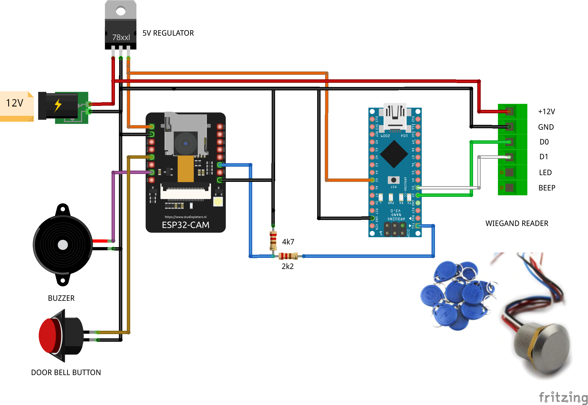

Esp32 Cam plus Wiegand reader and door bell
=====================

.. seo::
    :description: Instructions on using an Esp 32 Cam plus an Arduino nano to read wiegand irfid tag readers
    :image: ESP32-Cam-Wiegand_bb.png
    :keywords: Arduino Wiegand ESPHome Door bell

With this project is possible to use an Esp32 cam to manage at one time a cam, a door bell and an irfid tag 
reader used to open in secure way a door/gate.

